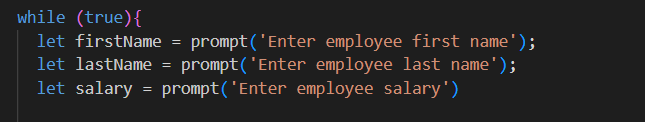
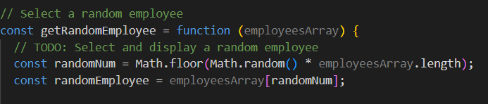
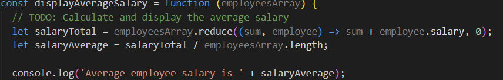

# module3-challenge
Homework 3

## Overview
This project manages inputed employee data, including collecting employee name and salary. It also will calculate the average salary or all inputed employees and select a random winner from them.

## Features
Inputs from user
Random selection
Salary averaging

## Technologies Used
HTML
JavaScript
CSS

